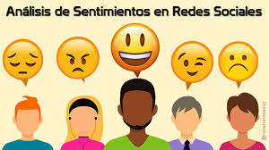

# W6-Project---Chat-Sentiment-Analysis-Service

 

Vamos a analizar los mensajes de chat  y crear métricas de opinión de las diferentes personas. El objetivo de este proyecto es analizar las conversaciones para asegurarse de que sean felices 😃.

Usare:

- API (bottle, flask)
- NLTK sentiment analysis
- Docker, Heroku and Cloud databases
- Recommender systems

## Links - API dev in python

- [https://bottlepy.org/docs/dev/]
- [https://www.getpostman.com/]

## Links - NLP & Text Sentiment Analysis

- [https://www.nltk.org/]
- [https://towardsdatascience.com/basic-binary-sentiment-analysis-using-nltk-c94ba17ae386]
- [https://www.digitalocean.com/community/tutorials/how-to-perform-sentiment-analysis-in-python-3-using-the-natural-language-toolkit-nltk]

# Links - Heroku & Docker & Cloud Databases

- [https://docs.docker.com/engine/reference/builder/]
- [https://runnable.com/docker/python/dockerize-your-python-application]
- [https://devcenter.heroku.com/articles/container-registry-and-runtime]
- [https://devcenter.heroku.com/categories/deploying-with-docker]
- Mongodb Atlas [https://www.mongodb.com/cloud/atlas]
- MySQL ClearDB [https://devcenter.heroku.com/articles/cleardb]

## Other ideas

- [https://www.kaggle.com/rounakbanik/movie-recommender-systems]

